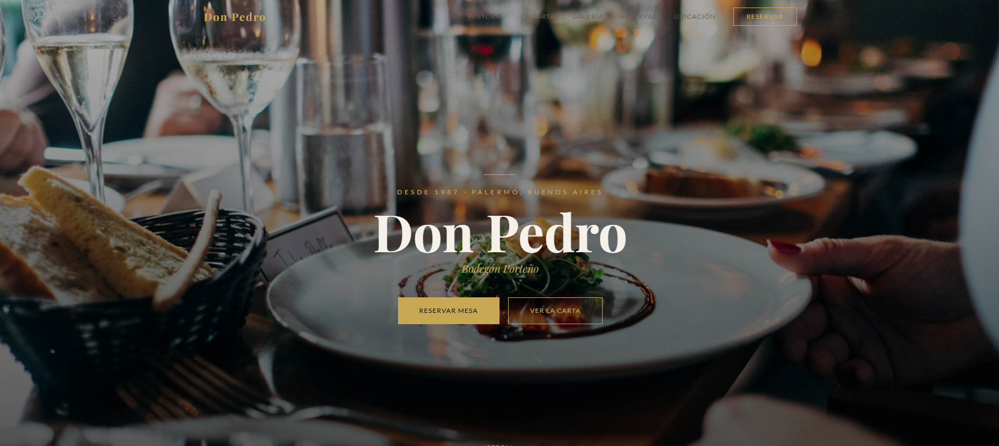
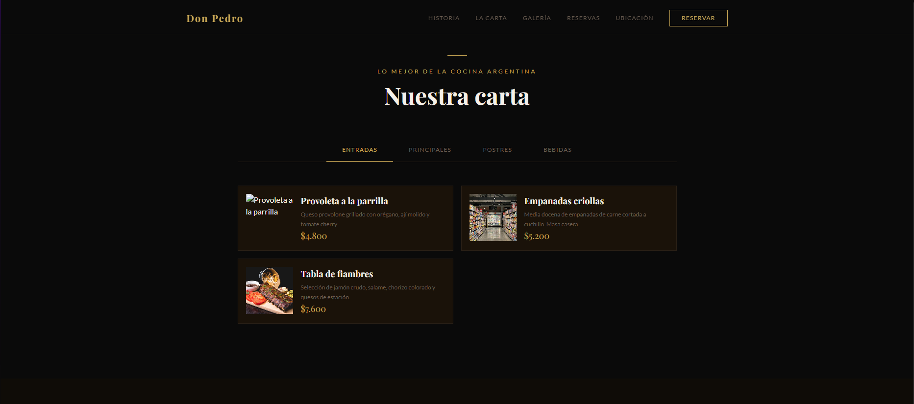
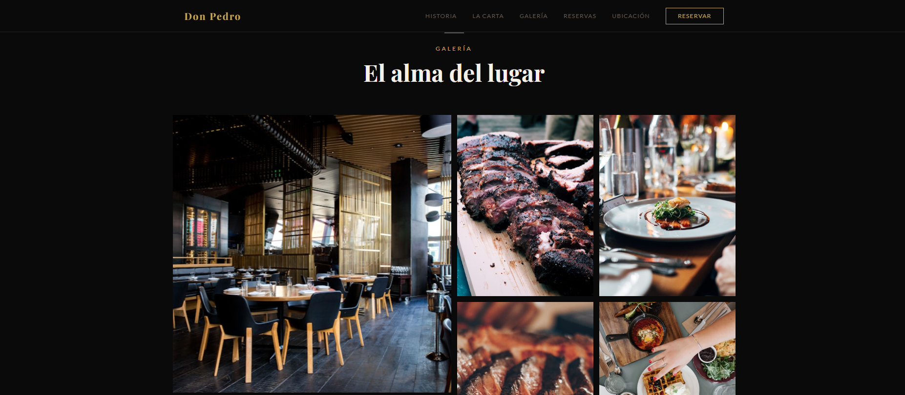
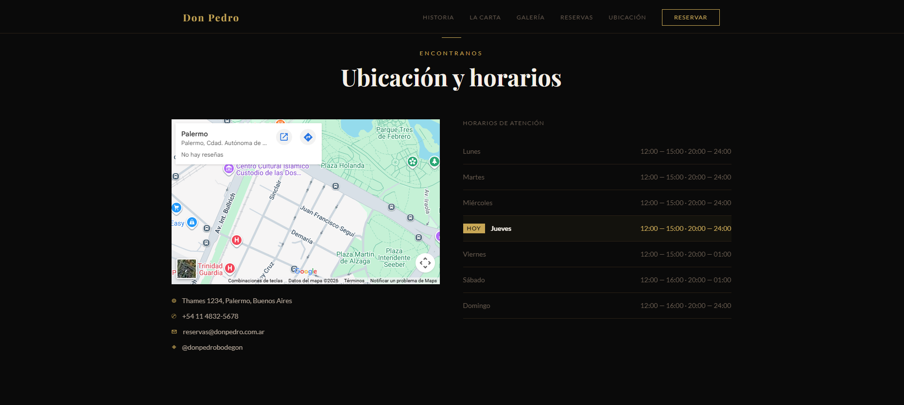

# Don Pedro — Bodegón Porteño

Landing page para un restaurante argentino ficticio. Proyecto de portfolio con diseño oscuro y elegante, animaciones de scroll y funcionalidades interactivas.

🔗 [Ver demo en vivo](https://don-pedro-beta.vercel.app)

---

## Funcionalidades

- Hero fullscreen con animaciones de entrada
- Sección historia con estadísticas animadas
- Menú interactivo con tabs por categoría (Entradas, Principales, Postres, Bebidas)
- Formulario de reservas con validación completa y pantalla de confirmación
- Galería de fotos con lightbox al hacer click
- Carrusel de reseñas con autoplay
- Sección de ubicación con mapa y horarios — resalta el día actual
- Navbar fijo que cambia de transparente a oscuro al hacer scroll
- Diseño 100% responsive

## Tecnologías

- React 19 + Vite
- Tailwind CSS
- Framer Motion (animaciones de scroll y transiciones)
- React Hook Form (formulario de reservas)

## Correr el proyecto localmente

Requisitos: Node.js v18 o superior

```bash
git clone https://github.com/brunolopezx/don-pedro.git
cd don-pedro
npm install
npm run dev
```

Abrir [http://localhost:5173](http://localhost:5173) en el navegador.

## Estructura del proyecto

```text
src/
├── components/    # Navbar, Footer
├── sections/      # Hero, Historia, Menu, Reservas, Galeria, Resenas, Ubicacion
└── data/          # Datos del menú en JS
```

## Capturas

<p align="center">
  
  
  
  
</p>
